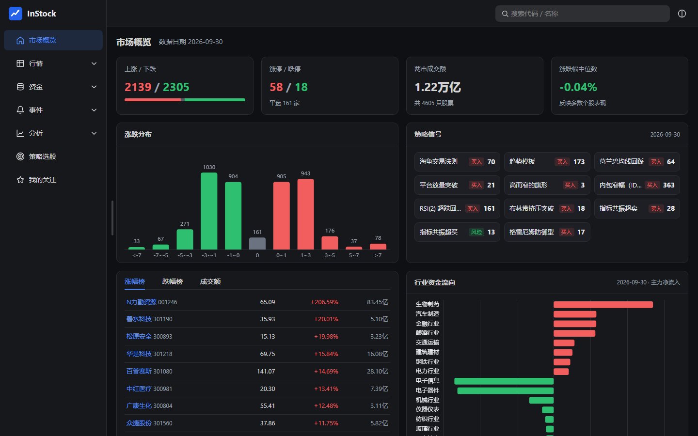
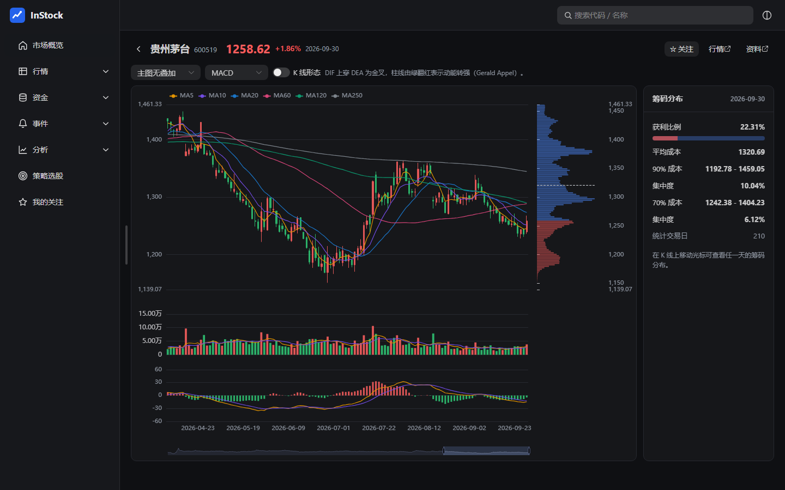
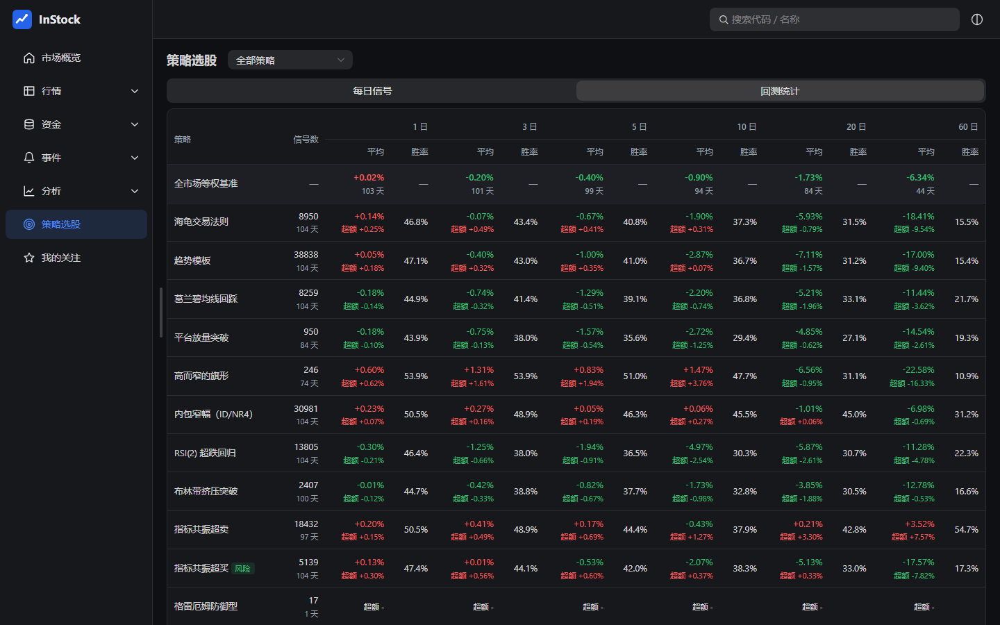
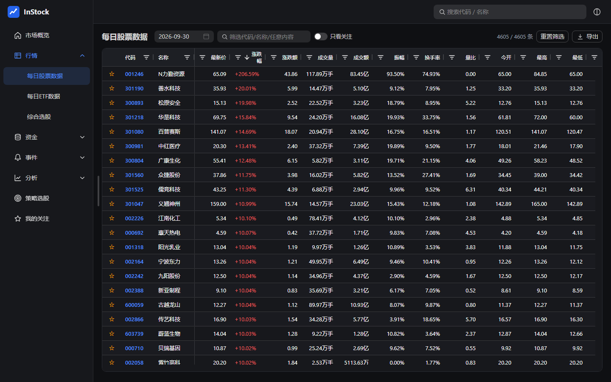
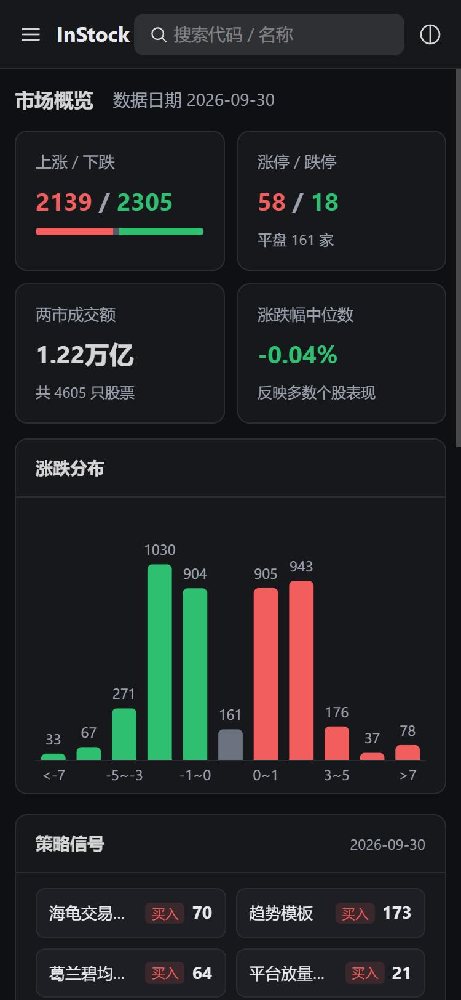
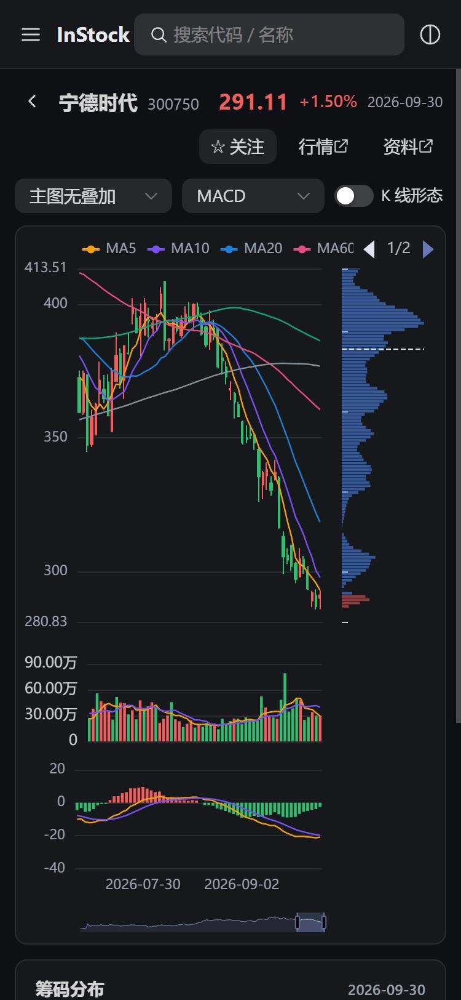

<p align="center">
  
</p>

<h1 align="center">InStock</h1>

<div align="center">


<a href="https://hub.docker.com/r/drdon1234/stock_assistant"></a>

<a href="LICENSE"></a>
<br>

<a href="#-快速开始">快速开始</a> ｜
<a href="#-买卖策略">买卖策略</a> ｜
<a href="#-数据源">数据源</a> ｜
<a href="#%EF%B8%8F-配置">配置</a> ｜
<a href="#-账号与安全">账号与安全</a> ｜
<a href="https://github.com/drdon1234/stock_assistant/issues">问题反馈</a>

</div>

<br>

InStock 是一款自托管的 A 股数据分析与选股系统，可部署在 Linux 服务器、NAS 或个人电脑上。它每天抓取沪深主板与创业板约 4600 只股票及全部 ETF 的行情、资金流向和事件数据，计算技术指标、K 线形态与筹码分布，运行有文献出处的买入与卖出策略，并自动统计每个策略的后验收益与相对全市场的超额收益。所有数据保存在本地，支持桌面与移动端浏览器访问。

> 本项目在 [InStock](https://github.com/myhhub/stock) 的基础上二次开发，重写了数据抓取、分析引擎与前端界面。

<p align="center">
  
</p>

## ✨ 主要功能

1. 📊 **行情与事件数据**：每日股票与 ETF 行情、综合选股（200 余项指标）、个股与板块资金流向、龙虎榜、大宗交易、分红配送、早盘/尾盘抢筹、涨停原因。
2. 📈 **技术分析**：MACD、KDJ、RSI、BOLL、DMI 等 30 余类技术指标（按通达信/同花顺公式实现），61 种 TA-Lib K 线形态。
3. 🎯 **买卖策略**：10 个买入策略与 5 个卖出（离场/风险）策略，均按原始文献实现，分别作为独立入口，每个策略单独成页并列出通俗解释、规则、出处与配套策略。
4. 🧪 **策略回测**：信号次日开盘买入，统计持有 1~60 个交易日的收益、胜率，以及相对全市场等权基准的超额收益。
5. 🧩 **聚宽策略回测**：直接粘贴或导入聚宽（JoinQuant）策略代码，在本地 2005 年以来的不复权日线上回测；按 A 股规则撮合（T+1、整手、停牌、涨跌停、费用、分红送转），输出收益曲线、风险指标与逐笔交易，策略在沙箱中运行。
6. 🕯️ **个股 K 线**：均线、主图叠加、25 种副图指标、形态标记；筹码分布随光标联动，显示获利比例、平均成本与集中度。
7. 🗃️ **数据表**：虚拟滚动，数千行数据流畅浏览；宽表按主题分组显示表头，可按组选择显示的列；支持按列筛选、排序、按日期查看历史与导出 CSV。K 线形态按“每只股票列出当天出现的形态”展示，可按形态与方向筛选。
8. ⭐ **我的关注**：关注列表按账号保存，各账号互不影响；关注的股票在各数据表中高亮，可只看关注。
9. ⏱️ **自动调度**：交易时段每 30 分钟刷新行情，交易日收盘后运行完整作业；也可按单日、多日或区间回补历史。
10. 🛡️ **稳定抓取**：优先使用限流宽松的数据源；每个数据源独立限速、重试并在连续失败时熔断，支持代理与 Cookie。
11. 📚 **学习中心**：术语表、技术指标、61 种 K 线形态、策略原理与回测解读；每个页面带可收起的页面说明，列头悬停显示该列的含义。
12. 📱 **响应式界面**：适配桌面与移动端，支持浅色与深色主题。
13. 🔐 **账号与登录**：多账号、管理员账号管理；登录后颁发长效凭证，常用设备无需反复登录，可安全部署到公网。

## 🚀 快速开始

| 方式 | 适用场景 | 前置条件 |
| --- | --- | --- |
| [一：Docker 部署（推荐）](#方式一docker-部署推荐) | 服务器或 NAS，长期运行 | Docker 与 Docker Compose v2 |
| [二：不使用 Docker](#方式二不使用-docker) | 本地试用或开发 | Python 3.11+、Node.js 20.19+ |

### 方式一：Docker 部署（推荐）

部署 MariaDB、网页服务（`instock-web`）、调度进程（`instock-worker`）与聚宽回测运行器（`instock-backtest`）四个容器，镜像 [`drdon1234/stock_assistant`](https://hub.docker.com/r/drdon1234/stock_assistant) 直接从 Docker Hub 拉取，无需克隆代码。

```bash
mkdir instock && cd instock
curl -fsSLO https://raw.githubusercontent.com/drdon1234/stock_assistant/main/docker-compose.yml
curl -fsSL https://raw.githubusercontent.com/drdon1234/stock_assistant/main/.env.example -o .env
sed -i "s/^DB_PASSWORD=.*/DB_PASSWORD=$(openssl rand -hex 16)/" .env
docker compose up -d
docker exec -it instock-web python -m instock user add admin    # 创建登录账号，按提示输入密码
```

`.env` 中可修改数据目录（`INSTOCK_HOME`，默认 `./data`）、网页端口（`INSTOCK_PORT`，默认 `9988`）与镜像版本（`INSTOCK_IMAGE`，默认 `latest`）。启动后访问 `http://<主机 IP>:9988`。

<details>
<summary>从源码构建镜像</summary>

```bash
git clone https://github.com/drdon1234/stock_assistant.git instock
cd instock
cp .env.example .env
sed -i "s/^DB_PASSWORD=.*/DB_PASSWORD=$(openssl rand -hex 16)/" .env
docker build -t drdon1234/stock_assistant:latest .
docker compose up -d
```

</details>

### 方式二：不使用 Docker

不配置数据库时自动使用 SQLite，数据保存在仓库下的 `data/`。

```bash
git clone https://github.com/drdon1234/stock_assistant.git instock
cd instock
python -m pip install -r requirements.txt
npm --prefix frontend ci
npm --prefix frontend run build
python -m instock user add admin    # 创建登录账号，按提示输入密码
python -m instock worker    # 调度进程，保持运行
python -m instock web       # 另开终端启动网页，访问 http://localhost:9988
python -m instock quant runner    # 可选：聚宽策略回测运行器（非沙箱，仅管理员可提交）
```

TA-Lib 0.6 起 PyPI 提供预编译包，一般无需另装 C 库。使用 MySQL/MariaDB 请参阅[配置](#%EF%B8%8F-配置)。

### 更新

```bash
docker compose pull && docker compose up -d    # 方式一（从源码构建则 git pull 后重新 docker build）
```

方式二在 `git pull` 后重新执行依赖安装与前端构建，并重启两个进程。启动时会自动建表、补齐新增列，无需手动迁移数据库。

## 🧭 首次运行

1. 网页需要登录。第一个账号自动成为管理员，可在网页右上角“账号设置与管理”中新建其他账号（见[账号与安全](#-账号与安全)）。
2. 调度进程启动后会对最近一个交易日补跑完整作业。首次需要抓取全部股票约 3 年的日 K 线，约 15 分钟；之后每个交易日只追加当日数据，完整作业通常 2~3 分钟。
3. 运行进度见日志：Docker 为 `docker logs -f instock-worker`，本地为 `data/log/worker.log`。
4. 需要历史区间的策略信号与回测统计时，可手动回补（实时类数据只能获取当前，回补时自动跳过）：

```bash
python -m instock run 2026-06-01 2026-09-30 --only analysis,backtest
# Docker：docker exec -it instock-worker python -m instock run 2026-06-01 2026-09-30 --only analysis,backtest
```

<details>
<summary>全部命令与任务</summary>

```bash
python -m instock run                               # 当前交易日完整作业
python -m instock run 2026-09-30                    # 指定日期，多日用逗号分隔
python -m instock run 2026-09-01 2026-09-30         # 指定区间
python -m instock run --only spot,etf               # 只运行部分任务
```

任务：`spot` 股票行情、`etf` ETF 行情、`selection` 综合选股、`fund_flow` 个股资金流、`sector_flow` 板块资金流、`bonus` 分红配送、`chip_open` 早盘抢筹、`limitup` 涨停原因、`lhb` 龙虎榜、`blocktrade` 大宗交易、`chip_end` 尾盘抢筹、`analysis` 指标/形态/策略、`backtest` 策略回测。

</details>

## 🎯 买卖策略

| 策略 | 类型 | 出处 |
| --- | --- | --- |
| 海龟交易法则（55 日突破） | 买入 | Curtis Faith《Way of the Turtle》；唐奇安通道 |
| 趋势模板 | 买入 | Mark Minervini《Trade Like a Stock Market Wizard》 |
| 葛兰碧均线回踩 | 买入 | Joseph Granville 移动平均线八大法则 |
| 平台放量突破 | 买入 | William O'Neil《How to Make Money in Stocks》 |
| 高而窄的旗形 | 买入 | Thomas Bulkowski《Encyclopedia of Chart Patterns》 |
| 内包窄幅（ID/NR4） | 买入 | Raschke & Connors《Street Smarts》 |
| RSI(2) 超跌回归 | 买入 | Connors & Alvarez《Short Term Trading Strategies That Work》 |
| 布林带挤压突破 | 买入 | John Bollinger《Bollinger on Bollinger Bands》 |
| 指标共振超卖 | 买入 | Wilder（RSI）、Lane（KDJ）、Lambert（CCI）、Williams（%R） |
| 格雷厄姆防御型 | 买入 | Benjamin Graham《The Intelligent Investor》第 14 章 |
| 海龟离场（20 日最低价） | 卖出 | Curtis Faith《Way of the Turtle》；唐奇安通道 |
| 吊灯止损（22 日最高价 − 3 倍 ATR） | 卖出 | Chuck LeBeau；Alexander Elder《Come Into My Trading Room》 |
| 放量跌破 50 日线 | 卖出 | William O'Neil《How to Make Money in Stocks》卖出规则 |
| 葛兰碧均线卖点 | 卖出 | Joseph Granville 移动平均线八大法则之卖点一 |
| 指标共振超买 | 卖出 | 同指标共振超卖 |

卖出策略多为跌破类规则，只在首次跌破当日触发。回测口径：信号日收盘后决策，次日开盘价买入，持有 N 个交易日按收盘价计算收益；超额收益为信号收益减去同日全市场等权基准。卖出策略的收益表示“继续持有”的结果，超额为负说明卖出信号有效。未扣除交易费用，也未考虑涨跌停无法成交。规则细节见 [`instock/analysis/strategies.py`](instock/analysis/strategies.py)。

## 🧩 聚宽策略回测

把在聚宽写好的策略代码粘贴到网页“聚宽策略回测”中（或导入 `.py` 文件），在本地历史数据上做日线回测。

**1. 回补历史数据**（首次约 7~8 小时，可中断后重跑续传；完成后调度进程每个交易日收盘后自动增量更新）：

```bash
python -m instock quant sync      # Docker：docker exec -it instock-worker python -m instock quant sync
python -m instock quant status    # 查看数据范围与运行器状态
```

数据来自 BaoStock：沪深 A 股（含科创板与已退市股票）2005 年以来的不复权日线、停牌与 ST 标记、复权因子、交易日历，常用指数日线，以及沪深 300、上证 50、中证 500 的历史成分（按周抽样）。保存为按年的内存映射宽表，约占 2~3 GB 磁盘。

**2. 运行回测**：网页提交后由回测运行器执行，也可在命令行直接回测一个策略文件：

```bash
python -m instock quant run my_strategy.py 2020-01-01 2024-12-31 --capital 1000000
```

| 范围 | 说明 |
| --- | --- |
| 支持的 API | `initialize`、`handle_data`、`before_trading_start`、`after_trading_end`、`run_daily/weekly/monthly`、`order/order_target/order_value/order_target_value`、`get_price`、`history`、`attribute_history`、`get_bars`、`get_current_data`、`get_extras('is_st')`、`get_all_securities`、`get_security_info`、`get_trade_days`、`get_index_stocks`、`set_benchmark/set_order_cost/set_slippage/set_option`、`record`、`log`、`g`，以及 `from jqdata import *` |
| 不支持 | `get_fundamentals` 等财务与估值数据、行业与概念、指数权重、资金流向、分钟线与 tick、期货、融资融券、读写文件；提交前“检查兼容性”会列出代码中的这些调用 |
| 时间与价格 | 只有日线：9:30 按开盘价成交，12:00 之后的时刻（如 14:50）按收盘价成交；`history` 等不含当天，`get_price` 收盘后才能取到当天；默认按回测当天动态前复权，按真实价格撮合 |
| 撮合规则 | T+1；整手买入（科创板至少 200 股）；停牌不能交易；涨停买不进、跌停卖不出（按历年涨跌幅与新股规则计算）；单笔不超过当日成交量；资金不足时按可用资金买入 |
| 费用与分红 | 默认佣金万三、最低 5 元，印花税按历年税率；除权日自动派息或送转股（红利不扣税） |

**3. 安全**：策略是任意 Python 代码。Docker 部署的 `instock-backtest` 容器无网络、无数据库凭证，只挂载回测数据目录；每个策略在降权为 `nobody` 的子进程中运行，看不到其他任务的代码、不能写文件，并限制内存、CPU 时间与进程数，所有账号都可以提交。不使用 Docker 时运行器没有沙箱，只有管理员可以提交回测。

## 🌐 数据源

替代源能提供同等信息时一律使用更稳定的源，仅东方财富独有的信息才请求东方财富，且每天只在收盘后与开盘首轮请求。

| 数据 | 来源 |
| --- | --- |
| 股票列表、ETF 列表、交易日历 | 新浪 |
| 股票与 ETF 行情、历史 K 线（前复权） | 腾讯 |
| 综合选股、行情中的基本面列、分单资金流向、龙虎榜、大宗交易、分红配送 | 东方财富 |
| 涨停原因 / 竞价抢筹 | 同花顺 / 通达信 |
| 聚宽策略回测的历史数据（不复权日线、复权因子、停牌、ST、指数成分） | BaoStock |

历史 K 线只在首次全量抓取，之后每个交易日直接用收盘行情追加一根；除权除息导致前复权价变化时自动重新抓取该股票。东方财富资金流向接口不可用时，降级为只含主力净流入的数据（个股取自选股器，板块取自新浪）。外部接口可能改版或限流，运行异常时请先查看日志。

## ⚙️ 配置

均为环境变量，Docker 部署时在 `.env` 或 `docker-compose.yml` 中设置。

| 变量 | 说明 | 默认 |
| --- | --- | --- |
| `INSTOCK_DATA_DIR` | 数据目录：K 线缓存、日志、SQLite 数据库、代理与 Cookie 文件 | `./data` |
| `MYSQL_HOST` / `MYSQL_PORT` / `MYSQL_USER` / `MYSQL_PASSWORD` / `MYSQL_DATABASE` | 使用 MySQL/MariaDB；不设置则使用 SQLite | — / 3306 / root / 空 / instockdb |
| `INSTOCK_DB_URL` | 完整的 SQLAlchemy 连接串，优先级最高 | — |
| `INSTOCK_WEB_HOST` / `INSTOCK_WEB_PORT` | 网页监听地址与端口 | `0.0.0.0` / `9988` |
| `INSTOCK_WORKERS` | 分析计算的进程数 | CPU 核数 - 1 |
| `INSTOCK_HIST_YEARS` | 首次抓取 K 线的年数 | 3 |
| `INSTOCK_RATE_<数据源>` | 覆盖数据源每秒请求数，如 `INSTOCK_RATE_TENCENT=3` | 见 [`instock/net.py`](instock/net.py) |
| `EAST_MONEY_COOKIE` | 东方财富 Cookie，也可写入数据目录下的 `eastmoney_cookie.txt` | — |
| `INSTOCK_ADMIN_USER` / `INSTOCK_ADMIN_PASSWORD` | 网页启动时若该账号不存在则创建为管理员（已存在时不修改密码） | — |
| `INSTOCK_SESSION_DAYS` | 登录凭证有效天数，每天首次访问自动续期 | 90 |
| `INSTOCK_TRUST_PROXY` | 部署在反向代理之后时设为 `1`，按 `X-Forwarded-For/-Proto` 识别客户端 IP 与 HTTPS | — |
| `INSTOCK_QUANT_START` | 聚宽回测数据的回补起始日期 | `2005-01-01` |
| `INSTOCK_QUANT_WORKERS` | 回补时连接 BaoStock 的进程数 | 4 |
| `INSTOCK_QUANT_TIMEOUT` / `INSTOCK_QUANT_MEMORY_MB` | 单个回测的最长秒数 / 沙箱内存上限 | 1800 / 3072 |
| `INSTOCK_QUANT_SANDBOX` | 回测运行器以沙箱方式执行策略（`instock-backtest` 容器中为 1） | — |

代理：在数据目录下创建 `proxy.txt`，每行一个 `ip:port` 或 `user:pass@ip:port`；失效的代理会被暂时剔除。

## 🔐 账号与安全

除登录接口外，所有数据接口都需要登录。登录成功后服务器颁发随机的长效凭证，保存在浏览器的 HttpOnly Cookie 中（网页脚本无法读取），有效期内每天首次访问自动续期，常用设备无需反复登录；数据库中只保存凭证的哈希。修改密码、重置密码或删除账号时，该账号在所有设备上的登录立即失效。

- **多账号**：每个账号有各自的关注列表。第一个账号自动成为管理员；管理员可在网页“账号设置与管理”中新建账号、重置密码、强制下线或删除账号。升级前不分账号的关注列表会归入第一个创建的账号。
- **防护**：密码使用 scrypt 加盐哈希；同一账号 15 分钟内连续 5 次、同一 IP 20 次登录失败后暂停登录；写操作校验自定义请求头并配合 SameSite Cookie 防御 CSRF。
- **公网部署**：请在前面加一层 HTTPS 反向代理（Nginx、Caddy 等），并设置 `INSTOCK_TRUST_PROXY=1`；通过 HTTPS 访问时 Cookie 自动带 `Secure` 标记。不要以纯 HTTP 暴露到公网。

```bash
python -m instock user add alice [--admin]    # 新建账号（Docker 前面加 docker exec -it instock-web）
python -m instock user passwd alice           # 重置密码，忘记管理员密码时使用
python -m instock user list                   # 列出账号、已登录设备数与最近使用时间
python -m instock user logout alice           # 让该账号在所有设备上退出登录
python -m instock user del alice              # 删除账号及其关注列表
```

## 📸 界面

<p align="center">
  
  
</p>
<p align="center">
  
  
  
  <br>
  <sub>个股 K 线 · 策略回测 · 数据表 · 移动端</sub>
</p>

## 🛠️ 开发

```
instock/
├── sources/      数据源适配（只做请求与字段映射）
├── net.py        HTTP 客户端：限速、并发上限、重试、熔断、代理轮换
├── market.py     数据服务：选源、降级、过滤
├── history.py    日 K 线本地缓存与增量更新
├── analysis/     指标、形态、策略、多进程分析引擎、回测
├── quant/        聚宽兼容回测：数据仓库、日线引擎、API 兼容层、静态检查、沙箱运行器
├── schema.py     数据字典（建表、入库与前端列格式）
├── auth.py       账号、密码哈希、登录凭证与登录限流
├── jobs.py       作业编排 · worker.py 调度 · web/app.py 接口
frontend/         Vue 3 + Vite + Naive UI + AG Grid + ECharts
```

```bash
python -m pip install pytest && python -m pytest tests     # 单元测试
npm --prefix frontend run dev                               # 前端开发服务器，/api 代理到 9988
```

## 🔒 数据与隐私

行情、分析结果、账号、关注列表与日志均保存在本地数据目录与数据库中。程序只访问上述数据源，不向其他服务发送任何数据。网页需要登录才能访问数据，部署到公网时请务必使用 HTTPS（见[账号与安全](#-账号与安全)）。

## ⚖️ 免责声明

本项目仅用于学习与研究，所有数据来自公开接口，不保证准确与及时，不构成任何投资建议。股市有风险，投资需谨慎。

## 📄 许可证

代码采用 [Apache License 2.0](LICENSE)，沿用原项目许可证。

## 🙏 致谢

感谢 [InStock](https://github.com/myhhub/stock)（myhhub/stock）项目及其作者。本项目是在 InStock 基础上的二次开发，保留了其整体定位与数据表设计，并对数据源、分析引擎、选股策略、回测与前端进行了重构。

## 💬 反馈与支持

问题与建议请通过 [Issues](https://github.com/drdon1234/stock_assistant/issues) 提交。欢迎通过 Star 支持本项目。
